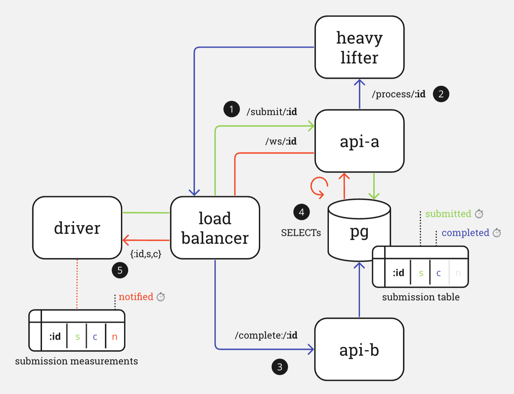

# aleph-stress

First experiment with `aleph` in the context of a toy architecture for:

- the offloading of work `submissions` from a load-balanced array of `api` servers to a `heavylifter` server (it just "sleeps" and doesn't actually do any heavy lifting);
- monitoring asynchronous completions of that work notified via `webhooks`; and
- notification of interested clients via their `websocket` connections (intermediated by a `postgres` table mapping `id`s to `completion` timestamps)

More details and results of stress testing with an async `driver` process coming soon...

__Disclaimer:__ this architecture is not intended to be optimal or even good, just simple. I'm interested to see where it hits the wall in terms of resource utilisation given the asynchronous architecture of `aleph`
